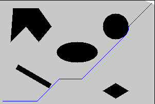
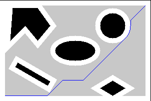

# Dijikstra_Algo
Implementing Dijikstra Algorithm on a map

## Dependencies
```
python3.5
Ubuntu 16.04
OpenCV 3.4.9
matplotlib
numpy
```

## Running the code

For point robot, run  
```
python3 Dijikstra_point.py
When you run the code you would be asked following details. For point robot enter the radius and clearance as 0.

Enter the Robot Radius : 
Enter the Robot Clearance: 
Enter the start Point: 
Enter the end Point:  
```
For rigid robot, run 
```
python3 Dijikstra_rigid.py
When you run the code you would be asked following details.

Enter the Robot Radius : 
Enter the Robot Clearance: 
Enter the start Point: 
Enter the end Point: 
```

## Notes
```
Run Time for sample input (5,5) and (295, 195) Point robot case: 14.722118854522705 (To find the path) 
Run Time for sample input (5,5) and (295, 195) Rigid robot case: 8.693345069885254 (To find the path)
```

## Results

Dijkstra Point robot result:



Dijkstra Rigid robot result with radius and clearance values as 5:

